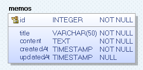

# MEMO API

## 기술 스택

- Spring Boot, Kotlin, JPA, MySQL

## ERD

## [Swagger-Ui 바로가기](http://localhost/swagger-ui/index.html)

## 구현 기능

- 메모 생성하기           `POST /api/v1/memo`
    - 메모에는 제목, 내용, 생성날짜, 수정날짜가 있다.
    - 날짜 형태는 yyyy-MM-dd HH:mm:ss 이다.

- 특정 메모 조회하기       `GET /api/v1/memo/{memoId}`
    - 기존에 있던 메모를 조회한다.

- 메모 수정하기           `PUT /api/v1/memo/{memoId}`
    - 기존에 있던 메모를 삭제한다.

- 메모 삭제하기           `DELETE /api/v1/memo/{memoId}`
    - 기존에 있던 메모를 삭제한다.

- 메모 검색하기           `GET /api/v1/memos/?date={date}&page={page}`
    - 날짜를 기준으로 최신순으로 한 페이지당 5개의 메모를 리스트 형태로 출력한다.
    - 날짜 형태는 yyyy-MM-dd이다.
